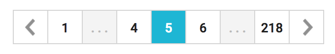

# react-page-selector
Drop-in React pagination component in Typescript

Uses lodash

## Props

- `page` - current page
- `totalPages` - total number of pages
- `action(page: number)` - onClick method for page button/arrow

## Example

```
<PageSelector
  page={5}
  totalPages={218}
  action={updatePage}/>
```

